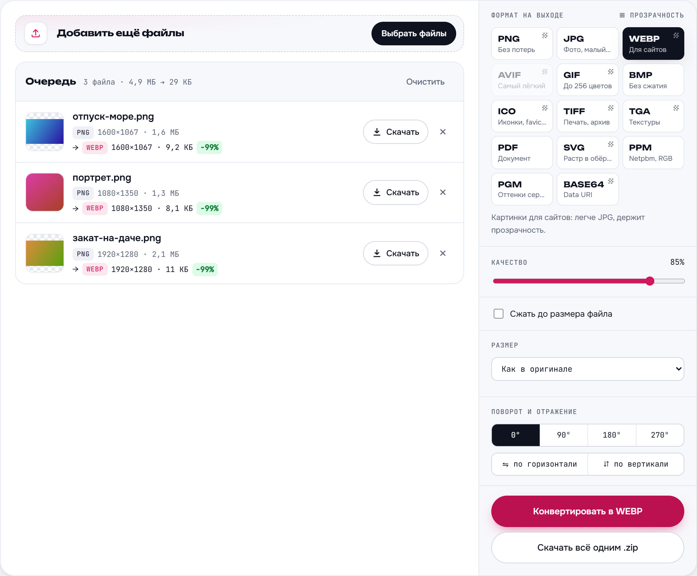
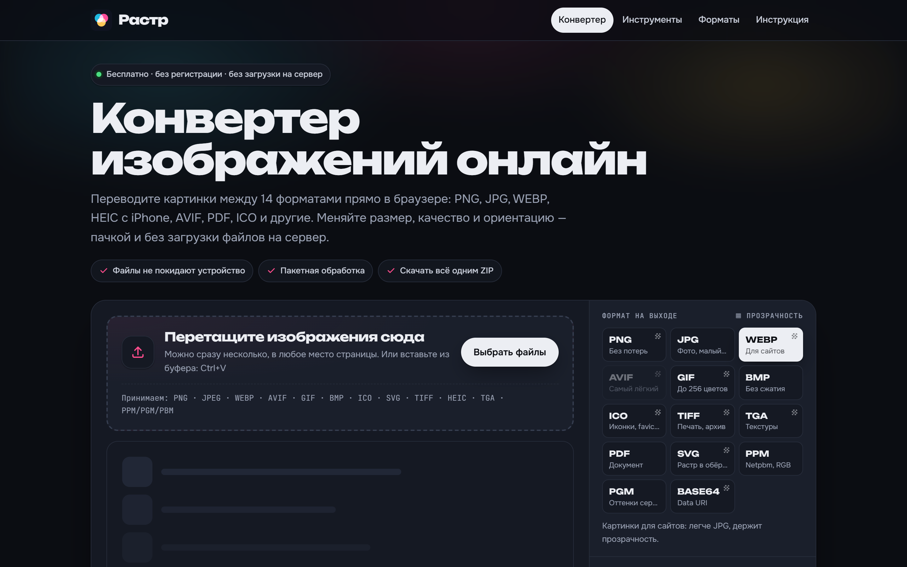
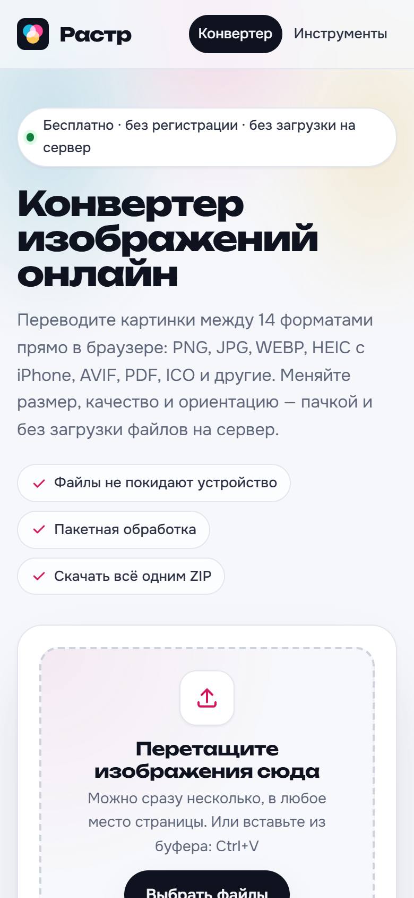
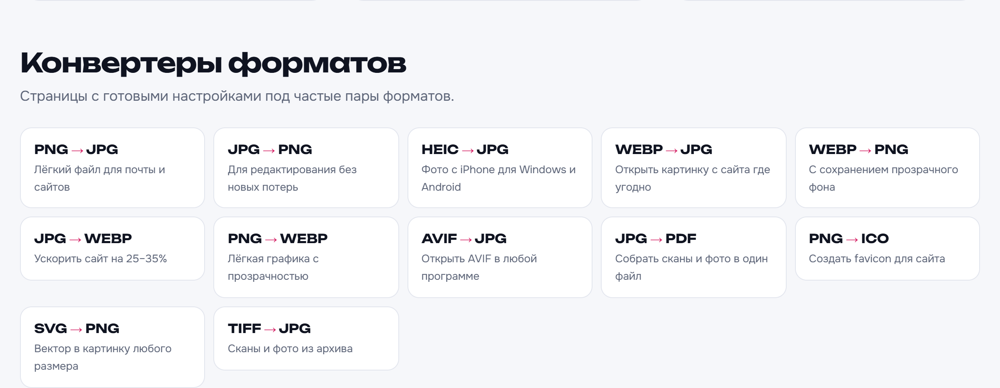
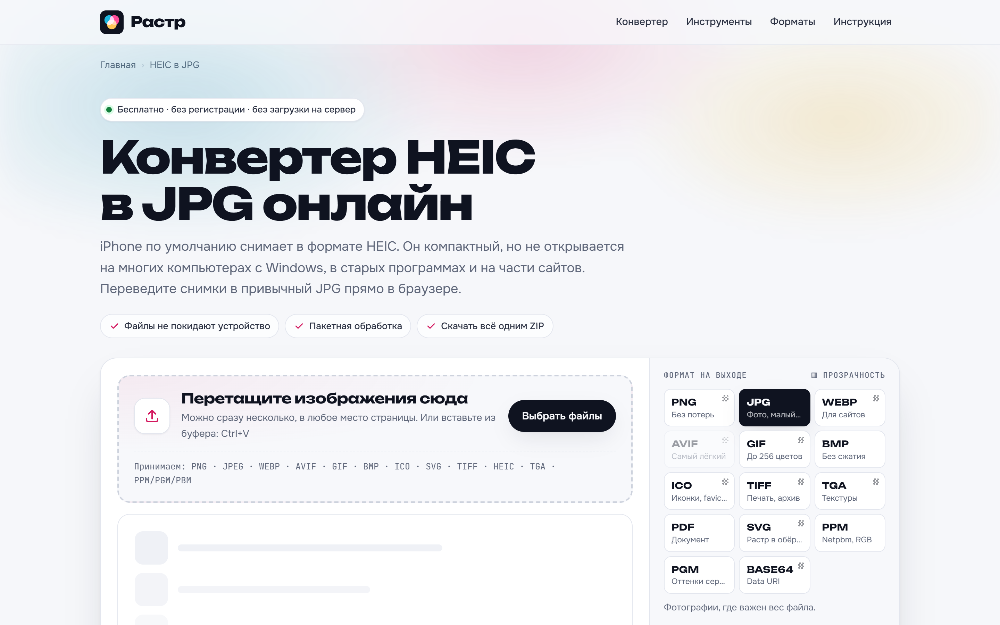

<p align="center">
  
</p>

<h1 align="center">Растр — конвертер изображений</h1>

<p align="center">
  Бесплатный онлайн-конвертер картинок между 14 форматами.<br>
  Всё работает прямо в браузере — файлы не загружаются на сервер.
</p>

<p align="center">
  
</p>

## Возможности

- **14 форматов на выход:** PNG, JPG, WEBP, AVIF, GIF, BMP, ICO, TIFF, TGA, PDF, SVG, PPM, PGM, Base64.
- **12 форматов на вход:** PNG, JPEG, WEBP, AVIF, GIF, BMP, ICO, SVG, TIFF, HEIC (фото с iPhone), TGA, PPM/PGM/PBM.
- **Пакетная обработка:** сотни файлов за раз, результат одним ZIP-архивом.
- **Настройки:** качество, фон вместо прозрачности, размер (в процентах, по ширине/высоте, в рамку), поворот и отражение, палитра GIF, размеры внутри ICO.
- **PDF из картинок:** собрать сканы и фото в один многостраничный документ.
- **Сравнение «до/после»** и экономия веса по каждому файлу.
- **Приватность:** конвертация на устройстве пользователя, без регистрации. Картинки никуда не передаются.
- **Яндекс Метрика** с Вебвизором (номер — в `site.config.mjs`): работает только на боевом домене, очередь файлов и окно сравнения скрыты от записи классом `ym-hide-content`, есть уведомление о cookies.
- **Счётчик посещений** в подвале (hits.sh): без cookies и скриптов слежки, включается в `site.config.mjs`.
- **Светлая и тёмная тема**, адаптивная вёрстка для телефонов.

<p align="center">
  
</p>

<table>
  <tr>
    <td width="62%"></td>
    <td width="38%"></td>
  </tr>
  <tr>
    <td align="center">Тёмная тема</td>
    <td align="center">На телефоне</td>
  </tr>
</table>

## Инструменты для фото

Отдельный раздел `/instrumenty/`: **Сжать фото**, **Сжать до N КБ** и **Размер фото**. Каждый инструмент открывается как самостоятельный сервис: только подходящие форматы, кнопка по действию («Сжать фото», «Изменить размер»), свои настройки первыми. В «Размере фото» есть формат «Как было» — каждый файл остаётся в своём формате.

## Страницы под поиск

Кроме главной, у сайта 14 посадочных страниц под частые запросы. На каждой свой текст, вопросы и ответы, а конвертер открывается уже настроенным под задачу.

<p align="center">
  
</p>

| Страница | Главный запрос |
|---|---|
| `/` | конвертер изображений |
| `/png-v-jpg/` | png в jpg |
| `/jpg-v-png/` | jpg в png |
| `/heic-v-jpg/` | heic в jpg |
| `/webp-v-jpg/` | webp в jpg |
| `/webp-v-png/` | webp в png |
| `/jpg-v-webp/` | jpg в webp |
| `/png-v-webp/` | png в webp |
| `/avif-v-jpg/` | avif в jpg |
| `/jpg-v-pdf/` | jpg в pdf |
| `/png-v-ico/` | png в ico, создать favicon |
| `/svg-v-png/` | svg в png |
| `/tiff-v-jpg/` | tiff в jpg |
| `/instrumenty/` | инструменты для фото (раздел со всеми инструментами) |
| `/szhat-foto/` | сжать фото |
| `/izmenit-razmer-foto/` | изменить размер фото |
| `/formaty/` | форматы изображений |

<p align="center">
  
</p>

**Что настроено для SEO:** статический HTML без необходимости выполнять JavaScript, понятные адреса, уникальные `title` / `description` / `H1`, `canonical`, Open Graph с отдельной картинкой-превью для каждой страницы, разметка schema.org (`WebApplication`, `FAQPage`, `BreadcrumbList`, `WebSite`, `Article`), хлебные крошки, перелинковка без страниц-сирот, `sitemap.xml`, `robots.txt`, страница 404 со статусом 404 и `noindex`, favicon и манифест. Всё это проверяется автотестами.

## Как устроен проект

| Папка / файл | Что это |
|---|---|
| `src/assets/rastr-convert.js` | Плагин конвертации без зависимостей: кодировщики GIF, BMP, ICO, TIFF, TGA, PDF, ZIP и др. |
| `src/assets/app.js`, `site.css` | Интерфейс конвертера и стили |
| `src/content/landings.mjs` | Тексты и настройки посадочных страниц |
| `src/content/formats.mjs` | Справочник форматов |
| `src/pages.mjs`, `src/layout.mjs` | Страницы, шаблон, метатеги и разметка |
| `tools/build.mjs` | Сборка сайта в `dist/`, sitemap, robots, манифест |
| `tools/icons.mjs`, `tools/screenshots.mjs` | Иконки, превью для соцсетей и скриншоты для README |
| `tools/check-live.mjs` | Проверка опубликованного сайта |
| `tests/` | Модульные, сквозные и SEO-тесты |
| `render.yaml` | Настройки публикации на Render |
| `site.config.mjs` | Адрес сайта и коды Яндекс Вебмастера / Google Search Console |

## Запуск на своём компьютере

Нужны Node.js 24 и Python (для локального сервера).

```bash
npm install
npm start          # собрать и открыть на http://localhost:5173
```

Другие команды:

```bash
npm run build      # собрать сайт в dist/
npm test           # собрать и прогнать все тесты (нужен Chrome или Edge)
npm run icons      # перерисовать иконки и превью после смены логотипа
npm run screenshots # переснять скриншоты для README
```

## Публикация на Render

Сайт статический, поэтому на Render он размещается бесплатно как **Static Site**. Все настройки лежат в `render.yaml`.

1. На [dashboard.render.com](https://dashboard.render.com): **New → Blueprint**, подключите GitHub и выберите этот репозиторий.
2. Render спросит `SITE_URL` — впишите будущий адрес, например `https://rastr.onrender.com`. Если Render выдаст другой адрес, исправьте переменную в Environment и нажмите Manual Deploy.
3. После деплоя проверьте живой сайт:
   ```bash
   npm run check:live -- https://rastr.onrender.com
   ```
4. Дальше каждый `git push` в `main` публикуется автоматически.

Свой домен: Settings → Custom Domains, затем поменяйте `SITE_URL` на новый адрес.

## Индексация

1. **Яндекс Вебмастер:** добавьте сайт, подтвердите метатегом (код — в `yandexVerification` в `site.config.mjs`), добавьте `sitemap.xml`.
2. **Google Search Console:** то же самое, код — в `googleVerification`.

## Плагин для своего сайта

```html
<script src="rastr-convert.js"></script>
<script>
  const res = await RastrConvert.convert(file, 'webp', {
    quality: 0.8,
    resize: { mode: 'width', width: 1200 }
  });
  // res.blob — готовый файл, res.name — «photo.webp»
</script>
```

Также доступны `formats()`, `decode()`, `encode()`, `zip()`, `pdfFromCanvases()` и `register()` для своих форматов.

## Безопасность

- **Content Security Policy** в каждой странице: скрипты только с сайта и трёх закреплённых версий декодеров на jsDelivr, встроенные скрипты запрещены, object-src 'none', ase-uri 'self'. 'unsafe-eval' оставлен только ради декодера HEIC (heic2any собран Emscripten).
- **Subresource Integrity:** у декодеров TIFF и HEIC с CDN проверяется хэш — подменённый файл браузер не запустит.
- **Заголовки** (в 
ender.yaml): HSTS, X-Content-Type-Options, X-Frame-Options и rame-ancestors, Referrer-Policy, Permissions-Policy, Cross-Origin-Opener-Policy.
- Имена файлов и сообщения выводятся с экранированием, пользовательские SVG открываются только как картинки.
- Зависимостей у сайта нет; 
pm audit — 0 уязвимостей.

Всё это проверяется в 	ests/security.test.mjs, а на живом сайте — командой 
pm run check:live.

## Лицензии сторонних компонентов

Модули чтения TIFF (UTIF.js, pako) и HEIC (heic2any, libheif) загружаются с jsDelivr только при открытии таких файлов. Шрифты Unbounded, Onest и JetBrains Mono — SIL Open Font License 1.1. Подробности — на странице `/licenzii/`.
